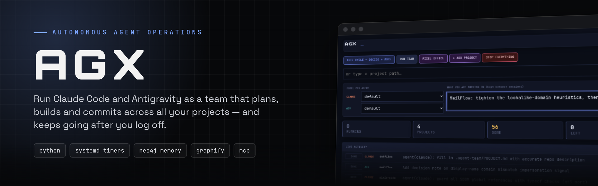
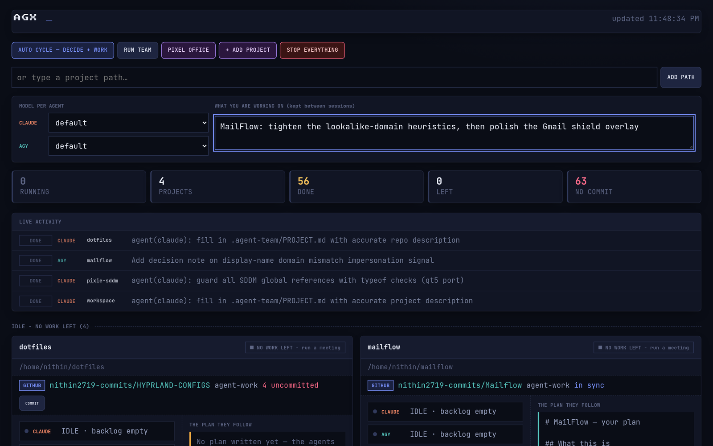
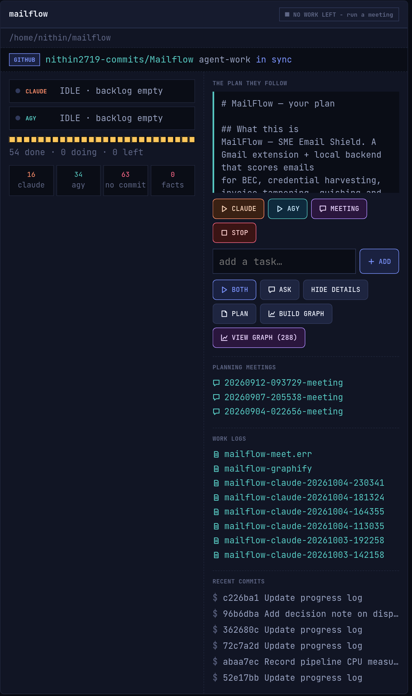
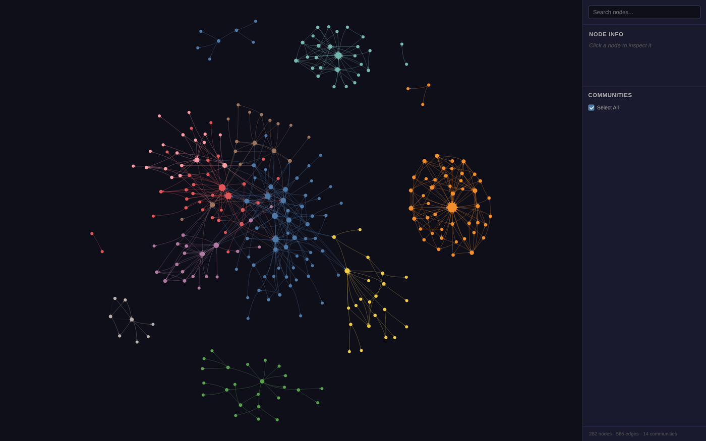

<div align="center">



<br>

[](#requirements)
[](#quick-start)
[](#what-it-does)
[](#architecture)

**An operations console for a team of autonomous coding agents.**

[Screenshots](#screenshots) · [What it does](#what-it-does) · [Architecture](#architecture) · [Quick start](#quick-start) · [Commands](#command-reference)

</div>

AGX runs Claude Code and Antigravity (`agy`) — plus optional free-tier API
models — as a coordinated team that plans, builds, reviews, and commits work
across every one of your projects. You watch and steer it from one dashboard;
it keeps working on a schedule, remembers each project between sessions, and
resumes on its own after a usage limit resets.

It is built on the CLI subscriptions you already pay for. There are no per-token
API keys to run the core team, and no cloud service in the loop — everything is
local.

---

## Why it exists

A single coding agent forgets everything between sessions, works one task at a
time, and sits idle whenever you are not driving it. AGX turns that into a team:

- **Two agents that disagree.** Claude and `agy` hold a real planning meeting —
  one proposes, the other reads the same code and pushes back — then commit to an
  agreed task list. Two specialists reach better decisions than one generalist.
- **Memory that survives sessions.** Every project keeps its own plan, progress
  log, and a queryable knowledge graph of its own code, so the next run starts
  where the last one stopped instead of from zero.
- **Work that does not stop.** Systemd timers wake the team on a schedule. When a
  usage limit resets, the agents pick up the backlog again with no prompting.

---

## Screenshots



<p align="center"><sub><b>The console.</b> Start or stop the whole team, choose a model per agent, and watch every commit land in the live feed.</sub></p>

<table>
<tr>
<td width="40%" valign="top"></td>
<td width="60%" valign="top"></td>
</tr>
<tr>
<td align="center"><sub><b>Project card.</b> Plan, agent status, planning meetings, work logs and recent commits.</sub></td>
<td align="center"><sub><b>Code graph.</b> The Graphify map agents navigate by: 282 nodes, 585 edges, 14 communities.</sub></td>
</tr>
</table>

---

## What it does

| Capability | How it works |
|---|---|
| **Plan collaboratively** | A three-round meeting: one agent proposes, the other challenges from the real code, they agree a fine-grained task list. |
| **Build autonomously** | Each agent claims one task, edits only inside the project, runs tests, and commits one change at a time. |
| **Remember per project** | `PROJECT.md`, `PROGRESS.md`, and a Neo4j knowledge graph, all scoped to the project and carried in its repo. |
| **Understand the codebase** | Graphify builds an AST-level graph — call relationships, hub functions, communities — so agents navigate instead of grepping blindly. |
| **Choose the workers** | Per project, select which agents run and which model each uses, from the fastest cheap tier to the strongest reasoning model. |
| **Fall back to free APIs** | With no Claude/agy quota, a free-tier worker (NVIDIA NIM or OpenRouter) handles the lighter tasks. |
| **Add project tools** | Enable MCP servers per project (for example, offensive-security tooling for a CTF repo) without affecting any other project. |
| **Assign roles** | Give each agent an engineering role — AI engineer, backend architect, code reviewer — that shapes how it argues in meetings. |
| **Stay in control** | Start, stop, commit, push, and question the agents from the dashboard. One button stops everything. |

---

## Architecture

```
        ┌──────────────────────────────────────────────┐
        │                Dashboard (:8765)              │
        │   status · plans · live feed · model picker   │
        │   start / stop · commit / push · ask an agent │
        └───────────────┬──────────────────────────────┘
                        │
     ┌──────────────────┼──────────────────┐
     ▼                  ▼                  ▼
  meeting            workers            memory
  (meet.sh)          (run.sh)           ┌─────────────────────┐
  Claude ⇄ agy       Claude / agy /     │ PLAN · PROGRESS      │
  agree tasks        free-API           │ Neo4j graph memory   │
                     one commit each    │ Graphify code graph  │
                                        └─────────────────────┘
        scheduled by systemd timers · resumes after limit resets
```

Every project carries its own state in a `.agent-team/` directory, so the memory
travels with the repository and nothing is global.

---

## Quick start

```bash
bash up.sh                      # start the dashboard, graph memory, and office
bash add-project.sh /path/repo  # register a git repo (memory + graph auto-built)
```

Then open **http://localhost:8765** and:

1. Write what you want in the project's plan.
2. Run a planning meeting — the agents agree the tasks.
3. Start the agents, or let the timers run them.

For continuous, hands-off operation:

```bash
cp systemd/*.service systemd/*.timer ~/.config/systemd/user/
systemctl --user daemon-reload
systemctl --user enable --now agent-dashboard.service agent-cycle.timer
```

---

## Command reference

| Command | Purpose |
|---|---|
| `bash up.sh` | Start every service; print the links. |
| `bash add-project.sh <repo>` | Register a project and build its memory + graph. |
| `bash meet.sh <repo>` | Run a two-agent planning meeting. |
| `bash cycle.sh` | Meet where work ran out, then let both agents work. |
| `bash team.sh` | One work round by both agents across all projects. |
| `bash stop.sh` | Stop all agents (escalates to force-kill). |
| `bash health.sh` | Report what is up and what is down. |
| `bash focus.sh <name>` | Point the team at one project, or `all`. |
| `python3 mcp.py catalog` | List MCP servers you can enable per project. |
| `python3 roles.py list` | List engineering roles you can assign. |

---

## Requirements

- Linux with systemd (developed on Arch)
- Claude Code and/or Antigravity (`agy`) CLIs, authenticated
- Docker (for the Neo4j graph memory)
- Python 3.12 and `uv`
- Optional: an NVIDIA NIM or OpenRouter key for the free-tier worker

---

## Safety

- Agents run as your user — they cannot touch anything outside a project, and the
  system prompt forbids destructive commands.
- Everything is committed to git, so any change is reviewable and reversible.
- Point the team at a dedicated branch until you trust it.
- Commit messages are written as the repository owner would write them, with no
  automated attribution added.
